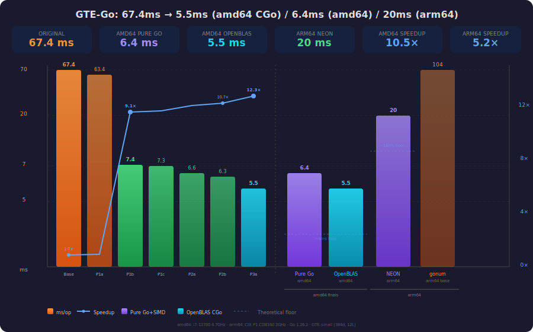

# GTE-Small in Go

A pure Go implementation of the [GTE-small](https://huggingface.co/thenlper/gte-small) text embedding model. Produces 384-dimensional, L2-normalized embeddings suitable for similarity search and clustering, ported from [@antirez's C implementation](https://github.com/antirez/gte-pure-C).

**Single static binary. No C dependencies. SIMD-accelerated.**

| Platform | Pure Go + assembly | OpenBLAS CGo (opt-in) |
|---|---|---|
| **amd64** (i7-12700) | **6.4 ms/embed** — 10.5× faster | 5.5 ms — 12.3× |
| **arm64** (CIX P1 CD8160) | **20 ms/embed** — 5.0× faster¹ | — |

¹ vs gonum-only baseline on same hardware.



## Quick Start

```bash
pip install safetensors requests numpy
python convert_model.py models/gte-small gte-small.gtemodel
make run-go                          # pure Go (default)
CGO_ENABLED=1 make run-go           # with OpenBLAS
```

## API

```go
import "github.com/rcarmo/gte-go/gte"

model, _ := gte.Load("gte-small.gtemodel")       // or LoadMmap() for fast startup
defer model.Close()

emb, _ := model.Embed("Hello world")              // []float32, L2-normalized
batch, _ := model.EmbedBatch([]string{"hi", "there"})
batch, _ = model.EmbedBatchParallel(texts, 0)     // parallel with N workers
sim, _ := gte.CosineSimilarity(batch[0], batch[1])
```

## Build

| Mode | Command | Binary |
|---|---|---|
| **Pure Go + SIMD (default)** | `make` | Static, portable |
| OpenBLAS CGo | `CGO_ENABLED=1 make` | Dynamic, links libopenblas |

Default is `CGO_ENABLED=0`. Use `Load()` for pure Go builds, `LoadMmap()` for OpenBLAS.

## Testing

```bash
GTE_MODEL_PATH=gte-small.gtemodel go test ./...   # 52+ tests
make go-bench                                       # inference benchmark
```

## Documentation

- **[docs/optimization-report.md](docs/optimization-report.md)** — detailed 4-phase optimization narrative
- **[docs/simd-assembly.md](docs/simd-assembly.md)** — SIMD kernel reference and register conventions
- **[docs/benchmarks.md](docs/benchmarks.md)** — cross-platform benchmark tables

## Architecture

SIMD assembly for amd64 (AVX2+FMA) and arm64 (NEON) in `gte/simd/`:

| Kernel | amd64 | arm64 | Used for |
|---|---|---|---|
| `Sdot` | 16-wide FMA | 8-wide VFMLA | Attention dot products |
| `SgemmNN` | 32-wide tiled | 16-wide tiled | Attention context multiply |
| GEBP micro-kernel | 6×16 tile | 4×16 tile | NT matmul (arm64) |

NT dispatch: gonum on amd64 (fast asm DotUnitary), GEBP+NEON on arm64.

## Model Format

`.gtemodel` — binary header + vocabulary + contiguous float32 weights.
Use `convert_model.py` to export from Hugging Face.

## License

MIT
