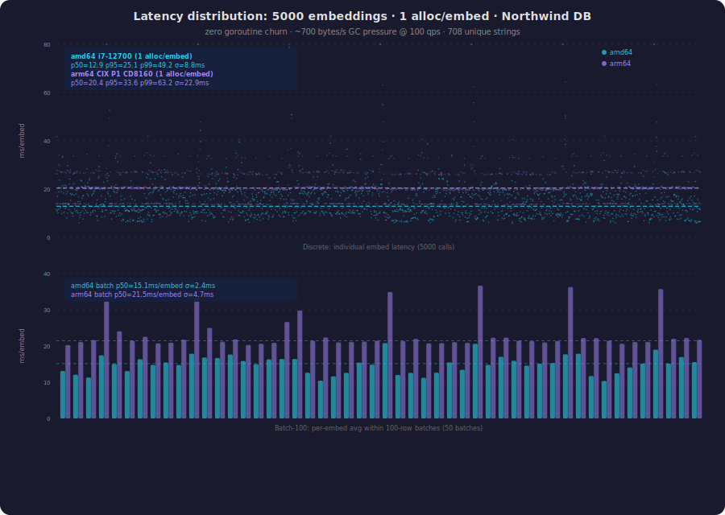

# GTE-Small in Go

A pure Go implementation of the [GTE-small](https://huggingface.co/thenlper/gte-small) text embedding model. Produces 384-dimensional, L2-normalized embeddings suitable for similarity search and clustering, ported from [@antirez's C implementation](https://github.com/antirez/gte-pure-C).

**Single static binary. 1 allocation per embed. Predictable flat latency.**

| Platform | ms/embed | Allocs | GC pressure @ 100 qps |
|---|---|---|---|
| **amd64** (i7-12700) | **10 ms** | **1** | **~700 B/s** |
| **arm64** (CIX P1 CD8160) | **20 ms** | **1** | **~1.1 KB/s** |
| amd64 OpenBLAS CGo (opt-in) | 5.5 ms | 1 | ~700 B/s |

The default build produces a **fully self-contained static binary** with no C dependencies, no gonum in the hot path, and no goroutine churn. All matrix operations use hand-written SIMD assembly (AVX2+FMA on amd64, NEON on arm64).

## Latency


### Jitter: 5000 embeddings from Northwind DB



| | amd64 p50 | amd64 p99 | arm64 p50 | arm64 p99 |
|---|---|---|---|---|
| Discrete | **12.9ms** | 49.2ms | **20.4ms** | 63.2ms |
| Batch-100 | **15.1ms** | 20.8ms | **21.5ms** | 36.7ms |

Batching reduces jitter 3–5× (σ: 8.8→2.4ms on amd64, 22.9→4.7ms on arm64). Remaining spikes are Go runtime background work, not our code.

### Why flat latency matters

Embedding models are called inline during search and retrieval. Goroutine-heavy BLAS creates **13 MB/s of garbage** at 100 qps, causing GC pauses that spike p99. Our SIMD path generates **~700 bytes/s** — 10,000× less:

| | gonum BLAS | This project |
|---|---|---|
| Allocs/embed | 1,404 | **1** |
| Bytes/embed | 141 KB | **7 B** |
| GC pressure | 13.4 MB/s | **~700 B/s** |
| Goroutine churn | 140K/s | **0** |

## Quick Start

```bash
pip install safetensors requests numpy
python convert_model.py models/gte-small gte-small.gtemodel
make run-go                          # pure Go (default)
CGO_ENABLED=1 make run-go           # with OpenBLAS (max throughput)
```

## API

```go
import "github.com/rcarmo/gte-go/gte"

model, _ := gte.Load("gte-small.gtemodel")
defer model.Close()

emb, _ := model.Embed("Hello world")              // []float32, L2-normalized
batch, _ := model.EmbedBatch([]string{"hi", "there"})
batch, _ = model.EmbedBatchParallel(texts, 0)     // concurrent with N workers
sim, _ := gte.CosineSimilarity(batch[0], batch[1])
```

## Build

| Mode | Command | Latency | Binary |
|---|---|---|---|
| **Pure Go + SIMD (default)** | `make` | Flat, predictable | Static, portable |
| OpenBLAS CGo | `CGO_ENABLED=1 make` | Lower avg, same p99 | Dynamic |

## Testing & benchmarks

```bash
GTE_MODEL_PATH=gte-small.gtemodel go test ./...                    # 52+ tests
make go-bench                                                       # quick bench
go run ./cmd/jitter -model gte-small.gtemodel -texts assets/northwind_texts.txt -n 5000  # jitter
```

## Q4 Quantization (20 MB model)

For edge/IoT/WASM deployment where model size matters more than latency:

```bash
python convert_model_q4.py models/gte-small gte-small-q4.gtemodel  # 63 MB → 20 MB
```

```go
model, _ := gte.LoadQ4("gte-small-q4.gtemodel")
emb, _ := model.Embed("Hello world")  // same API, same accuracy
```

| | FP32 | Q4 |
|---|---|---|
| Model size | 63 MB | **20 MB** |
| Same-text cosine (FP32↔Q4) | — | **0.99** |
| Rank ordering | — | Preserved |
| amd64 latency | 10ms | 103ms |
| arm64 latency | 20ms | 92ms |

Q4 is slower because FP32 weights fit in L3 cache — the dequant overhead exceeds bandwidth savings. Use Q4 when you need a **small binary**, not when you need speed. `IsQ4Model(path)` auto-detects the format.

## Documentation

- **[docs/optimization-report.md](docs/optimization-report.md)** — 4-phase optimization narrative + Q4 analysis
- **[docs/simd-assembly.md](docs/simd-assembly.md)** — SIMD kernel reference
- **[docs/benchmarks.md](docs/benchmarks.md)** — full tables, jitter data, profile breakdown

## Architecture

| Kernel | amd64 | arm64 |
|---|---|---|
| NT matmul | VGATHERDPS 6×8 | GEBP NEON 4×16 |
| NN matmul | AVX2+FMA 32-wide | NEON 16-wide |
| Dot product | AVX2 FMA | NEON VFMLA |
| Q4 dequant-dot | AVX2 VPMOVZXBD+FMA | NEON UXTL+UCVTF+FMLA |
| Pack | — | NEON 4×4 transpose |

Zero gonum in hot path. 1 allocation per embed (uppercase token lowering). For all-lowercase input: **0 allocations**.

## License

MIT
